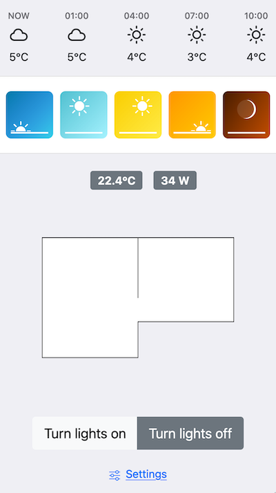
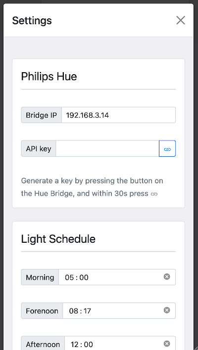
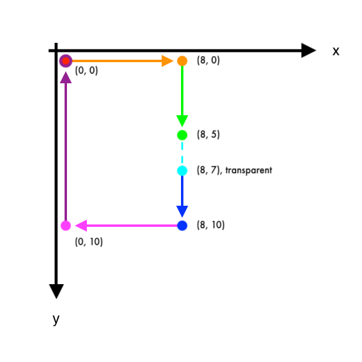

# Homecontrol

Set up a dashboard to control your Philips Hue lights using an old tablet or phone. You get a simple weather forecast and you can control your lights through a floor map.

 

**Features:**

- Generate a floor map from coordinates.
  - Get instant overview of which rooms have lights on.
  - Click on a room to toggle all its lights.
- Weather forecast from OpenWeatherMap.
- Scheduling of light temperature throughout the day.
  - Set the scheduled time for 5 different light temperatures, from energizing blue light, to relaxed red light.
  - Even if the lights are turned off, the light temperature will apply when you turn them on.
  - The current light temperature even applies if you turn on the lights in another app.
- Get the current temperature from Philips hue sensors.
- Get an estimate of the current power consumption of the lights.
- Turn individual lights on or off.

## How to run

The easiest way is to download and unzip the latest release on your computer. You can then just open `index.html` in your browser.

If you want more options, you can clone the repository

`git clone https://github.com/mnorlin/homecontrol.git`

and pull its [submodules](https://github.com/erikflowers/weather-icons) (used for the weather icons)

`git submodule init`

`git submodule update`

### Build your own release

Edit `package.json`, and add the line `"homepage": ".",` at the root of the json file. Execute `npm run build`, when finished, you can open up `./build/index.html` in your browser.

### Run as a docker container

`docker-compose build`

`docker-compose up -d`

The app is now available at `http://localhost:3000`.

### Run as an npm development server

`npm install`

`npm start`

The app is now available at `http://localhost:3000`.

## Generate a floor map

The floor plan for each room can be configured in the settings. It is generated by an array of objects with x- and y-coordinates representing points on the browser Canvas API. On the canvas, point zero is in the upper left corner.
A line is drawn between each coordinate in the array. If you want to make space for a door in a room, you can add the property `"transparent": true`, and the line drawn to that point will be transparent. See example code below, which was used for generating the rooms used in the app screenshot.

**Room 1**

```json
[
  { "x": 0, "y": 0 },
  { "x": 8, "y": 0 },
  { "x": 8, "y": 5 },
  { "x": 8, "y": 7, "transparent": true },
  { "x": 8, "y": 10 },
  { "x": 0, "y": 10 },
  { "x": 0, "y": 0 }
]
```



**Room 2**

```json
[
  { "x": 8, "y": 0 },
  { "x": 16, "y": 0 },
  { "x": 16, "y": 7 },
  { "x": 8, "y": 7 },
  { "x": 8, "y": 5, "transparent": true },
  { "x": 8, "y": 0 }
]
```

## Known issues

1. **The turned off lights flicker when changing light scene** - Philips Hue can't change the color of a light when it is turned off, so to enable that all lights have the same state when turned on, they will briefly need to be turned on and off to get their new state.

2. **The power consumption is just an estimate** - The estimate is based on the dimming percentage for the default light color for sultan, candle and light-strip models. If the model is of another type, it falls back to the sultan bulbs power consumption.

3. **The power consumption is never zero** - This is not a bug. The Hue bridge draws power, as well as the lights, even when turned off, so it will never show 0 Watt.

4. **Control section with light switches can't collapse** - This seems to be a bug in Bootstrap 5 alpha.
